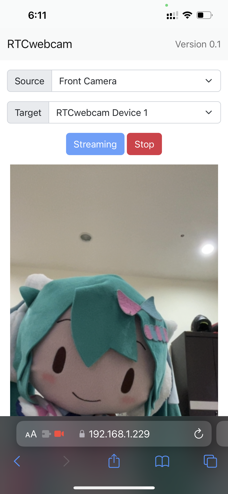
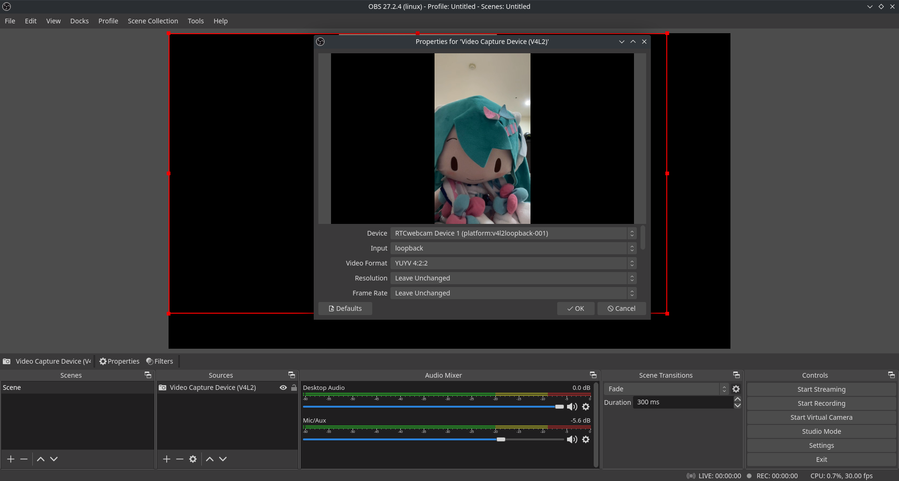
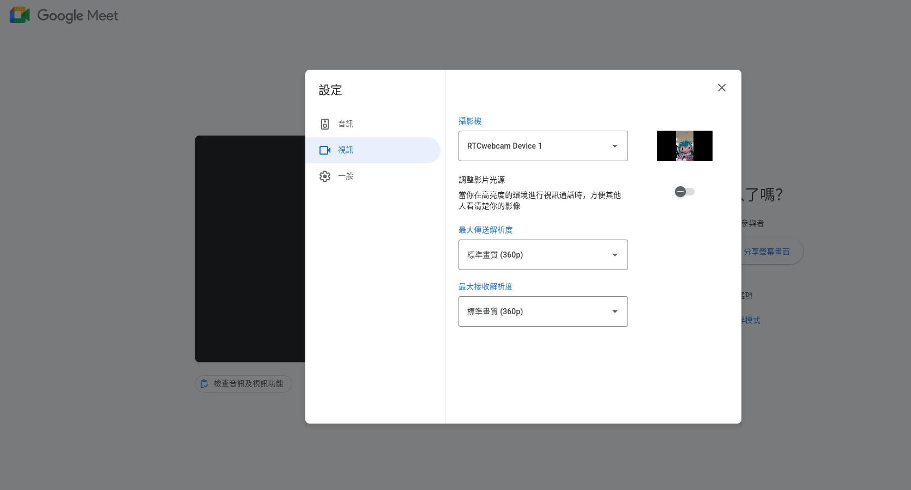

# RTCwebcam
RTCwebcam is a python application that can make use of a camera on other device(client) in the local area network as a virtual video device(webcam) on a linux computer(server). The application use the WebRTC API to send video stream of a client to the server, and use v4l2loopback to emulate video devices on the server.

## Requirements
- openssl
    - On ubuntu-based linux distribution, it can be installed with the following command:<br>
    `sudo apt install openssl`
- v4l2loopback
    - On ubuntu-based linux distribution, it can be installed with the following command:<br>
    `sudo apt install v4l2loopback-dkms`
- python packages
    - list in `requirements.txt`
    - can install all packages with the following command:<br>
    `pip install -r requirements.txt`

## Running
1. First Execute `run.sh`
    ```bash
    chmod +x run.sh
    ./run.sh
    ```

2. Then open the browser on a Android, IOS or other devices with cameras, and go to `https://<server-ip>:8080`.
    - One can reference the script output to know the possible server IP address.
    - Since a webpage can only request for camera permissions under secure connection mode, you need to use a `https://` link to access the webpage.
    - However, because the ssl certificate is self-signed, you will see a warning message when you open the webpage.
    - You can ignore the warning message and continue to use the webpage.
    - A popup window will appear to ask you to allow the application to access your camera. If not, please ensure that the browser has camera permission.

3. On the webpage, you can see the following options:
    - `Source`: Select the camera you want to use. Useful in case you have multiple cameras.
    - `Target`: Select the target device on the server you want to use.
    - `Streaming`: Start streaming.
    - `Stop`: Stop streaming.
    


4. After start streaming, you can see the preview of the camera on the bottom of the page. On the server-side, you can now open webpages or applications that need to use the camera, like Google Meet, OBS, etc. And you will see the video device labeled `RTCwebcam Device #` in the devices menu.

## Screenshots
- Client


- Server



## Additional Information
### Plugins
- The application is capable of inserting plugins to process each frame of the video stream.
- A plugin class needs to have `process` method that takes a `frame`, which is a `numpy array` in RGB format and have shape `(height, width, 3)`, as input and returns a `frame` in the same format as output.
- Please refer to `modules/Plugin.py` for more information.
- Currently, there are two simple plugins avaliable
    - `FlipPlugin`: Flip the video stream horizontally.
    - `PortraitPaddingPlugin`: Padding the video stream into landscape mode. Useful for applications that will force crop the video stream in potrait mode, ex. Google Meet.
- To add and activate a plugin, you need to add to add the plugin into `global_plugins` list in `server.py`, `PortraitPaddingPlugin` is enabled by default.

### Works with OBS virtual camera
- OBS will load `v4l2loopback` and create a virtual camera device at /dev/video0 (if not found) when it virtual webcam starts.
- `v4l2loopback-ctl` should have ability to add more virtual camera devices. However, I cannot let it work in my computer for now.
- Therefore, I chose to create more than one device while loading `v4l2loopback` module, and only use devices with `id>=1` to avoid corrupting, so one should start the application before starting OBS virtual camera, and make sure to let the script reload `v4l2loopback` moudle.
- After RTCwebcam starts, one can add it as a source of an OBS Scene by selecting `Video Capture Device (V4L2)` in the `Sources` menu.

## Limitations
- The application is only works on Linux for now.
- The resultion and framerate is force to be `640x360` and `30fps` for now. Though you can change the resolution and framerate in the first few lines in `static/client.js`, but it might not work as expected.

## Test Platform
- KDE neon with ubuntu 20.04
- python 3.8

## Credits
This project is modified from the following projects and links:
- [aiortc/examples](https://github.com/aiortc/aiortc/tree/main/examples)
- [用 Python+WebRTC 和吴彦祖视频](https://zhuanlan.zhihu.com/p/387772163)
- [Bootstrap](https://getbootstrap.com/)
- [jQuery](https://jquery.com/)

## TODO
- [ ] Add more plugins and make them be able to select from the front-end.
- [ ] Make use of [akvirtualcamera](https://github.com/webcamoid/akvirtualcamera) to emulate cameras on Windows and MacOS.
- [ ] Improve performance and add more resolution support.
- [ ] Make use of `v4l2loopback-ctl` to dynamically add or remove virtual camera devices.
